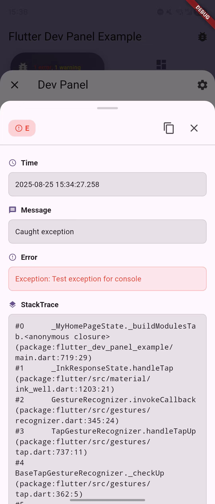
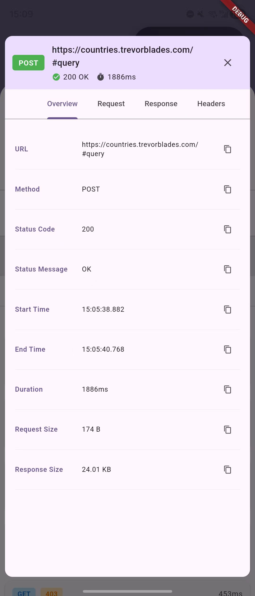

# Flutter Dev Panel

[](https://pub.dev/packages/flutter_dev_panel)
[](https://opensource.org/licenses/MIT)

A powerful, zero-intrusion debugging panel for Flutter applications with modular architecture and real-time monitoring capabilities.

[中文文档](README_CN.md) | [Getting Started](docs/getting_started.md) | [Configuration](docs/configuration.md)

## 📸 Screenshots

<table>
  <tr>
    <td></td>
    <td></td>
    <td></td>
    <td></td>
  </tr>
  <tr>
    <td></td>
    <td></td>
    <td></td>
    <td></td>
  </tr>
</table>

## ✨ Features

- 🚀 **Zero Intrusion** - No impact on production code, automatic tree-shaking in release builds
- 📦 **Modular Design** - Install only the modules you need
- 🔧 **Environment Management** - Switch environments on-the-fly with .env support
- 🎨 **Theme Sync** - Bidirectional theme synchronization with your app
- 📱 **Multiple Triggers** - FAB, shake gesture, or programmatic access
- ⚡ **High Performance** - Minimal overhead with smart optimization

## 🎯 Available Modules

| Module | Description | Features |
|--------|-------------|----------|
| **Console** | Advanced logging system | • Real-time log capture (print, debugPrint, Logger)<br>• Log level filtering<br>• Search functionality<br>• Smart multi-line merging |
| **Network** | HTTP & GraphQL monitoring | • Request/response tracking<br>• GraphQL operation monitoring<br>• JSON viewer with syntax highlighting<br>• Support for Dio, HTTP, GraphQL |
| **Performance** | Resource monitoring | • Real-time FPS tracking<br>• Memory leak detection<br>• Automatic Timer tracking<br>• Performance analysis |
| **Device** | System information | • Device specifications<br>• Screen metrics & PPI<br>• Platform details<br>• App package info |


## 🚀 Quick Start

### Installation

```yaml
dependencies:
  flutter_dev_panel: ^1.0.1
  
  # Add modules as needed
  flutter_dev_panel_console: ^1.0.1    # Logging
  flutter_dev_panel_network: ^1.0.1    # Network monitoring
  flutter_dev_panel_performance: ^1.0.1 # Performance tracking
  flutter_dev_panel_device: ^1.0.1      # Device info
```

### Basic Setup

```dart
import 'package:flutter_dev_panel/flutter_dev_panel.dart';
import 'package:flutter_dev_panel_console/flutter_dev_panel_console.dart';
import 'package:flutter_dev_panel_network/flutter_dev_panel_network.dart';

void main() async {
  // Initialize with automatic Zone setup for full functionality
  await DevPanel.init(
    () => runApp(const MyApp()),
    modules: [
      const ConsoleModule(),     // Auto-captures print statements
      NetworkModule(),           // HTTP/GraphQL monitoring
      const PerformanceModule(), // Auto-tracks Timers
    ],
  );
}

class MyApp extends StatelessWidget {
  @override
  Widget build(BuildContext context) {
    return MaterialApp(
      builder: (context, child) {
        // Wrap your app with DevPanelWrapper
        return DevPanelWrapper(
          child: child ?? const SizedBox.shrink(),
        );
      },
      home: MyHomePage(),
    );
  }
}
```

## 🔧 Integration Examples

### Network Monitoring

```dart
// Dio
final dio = Dio();
NetworkModule.attachToDio(dio);

// GraphQL
final link = NetworkModule.createGraphQLLink(
  HttpLink('https://api.example.com/graphql'),
);
final client = GraphQLClient(link: link, cache: GraphQLCache());

// HTTP
final client = NetworkModule.createHttpClient();
```

### Environment Management

```dart
// Get environment values
final apiUrl = DevPanel.environment.getString('api_url');
final isDebug = DevPanel.environment.getBool('debug');

// Listen to changes
DevPanel.environment.addListener(() {
  // Update your services when environment changes
});
```

### Access Methods

```dart
// Programmatic access
DevPanel.open(context);

// Via floating action button (default)
// Via shake gesture on mobile
// Configure in DevPanelConfig
```

## 📖 Documentation

| Guide | Description |
|-------|-------------|
| **[Getting Started](docs/getting_started.md)** | Installation, setup, and initialization methods |
| **[Configuration](docs/configuration.md)** | Environment variables, module configuration |
| **[Network Integration](docs/network_integration.md)** | Dio, HTTP, and GraphQL setup |
| **[Environment Usage](docs/environment_usage.md)** | Working with environment variables |
| **[GraphQL Guide](docs/graphql_environment_switching.md)** | Dynamic GraphQL endpoint switching |

## 🛡️ Production Safety

Flutter Dev Panel is designed with production safety as a priority:

```bash
# Normal release build (panel disabled, zero overhead)
flutter build apk --release

# Internal testing build (panel enabled)
flutter build apk --release --dart-define=FORCE_DEV_PANEL=true
```

- **Debug Mode**: Automatically enabled
- **Release Mode**: Completely removed by tree-shaking
- **Force Enable**: Optional for internal testing builds

## 📄 License

MIT License - see [LICENSE](LICENSE) file for details