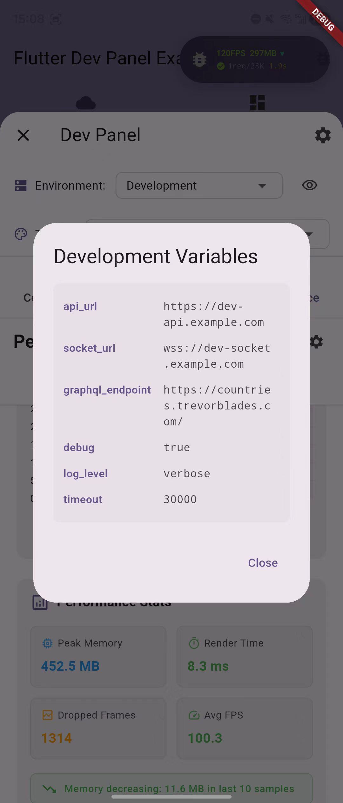
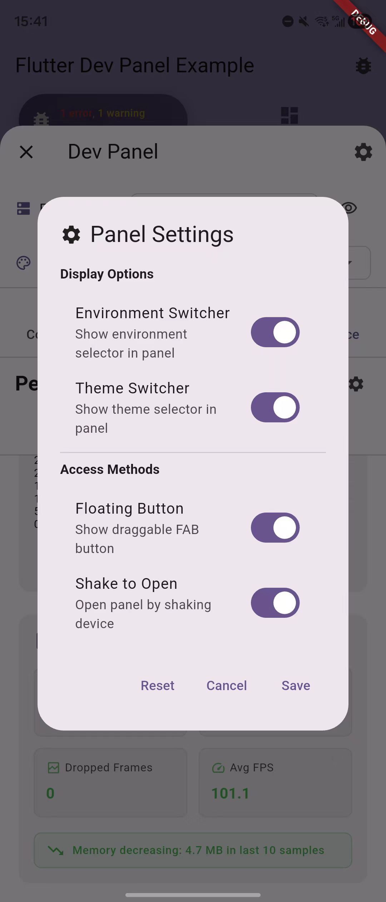
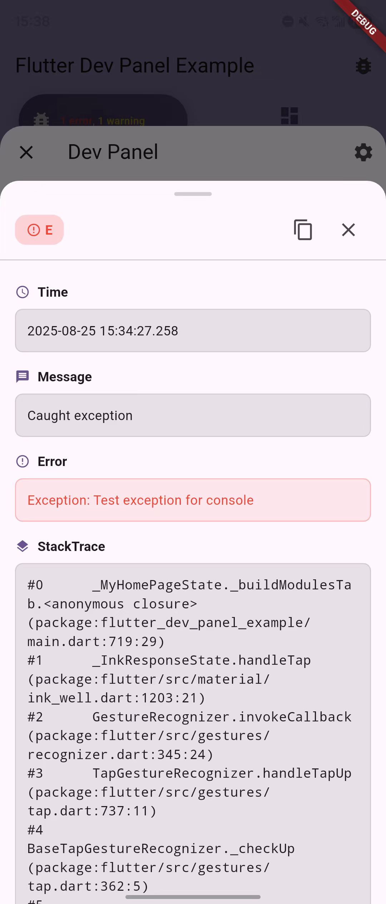
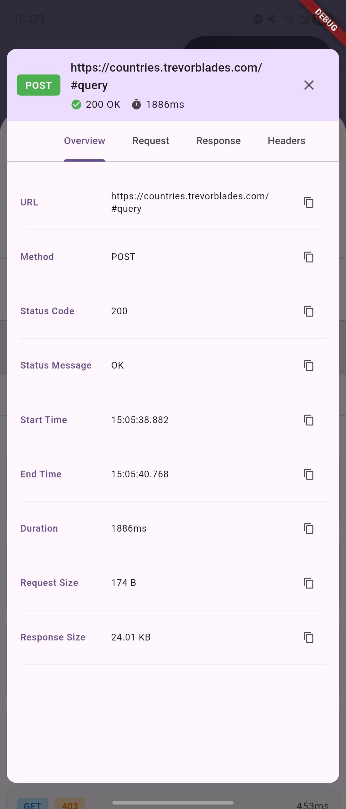

# Flutter Dev Panel

[](https://pub.dev/packages/flutter_dev_panel)
[](https://opensource.org/licenses/MIT)

一个功能强大、零侵入的 Flutter 应用调试面板，采用模块化架构，提供实时监控能力。

[English](README.md) | [快速开始](docs/getting_started.md) | [配置指南](docs/configuration.md)

## 📸 截图展示

<table>
  <tr>
    <td></td>
    <td></td>
    <td></td>
    <td></td>
  </tr>
  <tr>
    <td></td>
    <td></td>
    <td></td>
    <td></td>
  </tr>
</table>

## ✨ 特性

- 🚀 **零侵入** - 不影响生产代码，发布版本自动 tree-shaking
- 📦 **模块化设计** - 按需安装所需模块
- 🔧 **环境管理** - 即时切换环境，支持 .env 文件
- 🎨 **主题同步** - 与应用双向主题同步
- 📱 **多种触发方式** - 悬浮按钮、摇一摇或程序化调用
- ⚡ **高性能** - 智能优化，开销最小

## 🎯 可用模块

| 模块 | 描述 | 功能特性 |
|------|------|----------|
| **Console** | 高级日志系统 | • 实时日志捕获（print、debugPrint、Logger）<br>• 日志级别过滤<br>• 搜索功能<br>• 智能多行合并 |
| **Network** | HTTP & GraphQL 监控 | • 请求/响应跟踪<br>• GraphQL 操作监控<br>• 带语法高亮的 JSON 查看器<br>• 支持 Dio、HTTP、GraphQL |
| **Performance** | 资源监控 | • 实时 FPS 跟踪<br>• 内存泄漏检测<br>• 自动 Timer 跟踪<br>• 性能分析 |
| **Device** | 系统信息 | • 设备规格<br>• 屏幕指标与 PPI<br>• 平台详情<br>• 应用包信息 |

## 🚀 快速开始

### 安装

```yaml
dependencies:
  flutter_dev_panel: ^1.0.1
  
  # 按需添加模块
  flutter_dev_panel_console: ^1.0.1    # 日志
  flutter_dev_panel_network: ^1.0.1    # 网络监控
  flutter_dev_panel_performance: ^1.0.1 # 性能跟踪
  flutter_dev_panel_device: ^1.0.1      # 设备信息
```

### 基本设置

```dart
import 'package:flutter_dev_panel/flutter_dev_panel.dart';
import 'package:flutter_dev_panel_console/flutter_dev_panel_console.dart';
import 'package:flutter_dev_panel_network/flutter_dev_panel_network.dart';

void main() async {
  // 使用自动 Zone 设置初始化，获得完整功能
  await DevPanel.init(
    () => runApp(const MyApp()),
    modules: [
      const ConsoleModule(),     // 自动捕获 print 语句
      NetworkModule(),           // HTTP/GraphQL 监控
      const PerformanceModule(), // 自动跟踪 Timers
    ],
  );
}

class MyApp extends StatelessWidget {
  @override
  Widget build(BuildContext context) {
    return MaterialApp(
      builder: (context, child) {
        // 用 DevPanelWrapper 包装应用
        return DevPanelWrapper(
          child: child ?? const SizedBox.shrink(),
        );
      },
      home: MyHomePage(),
    );
  }
}
```

## 🔧 集成示例

### 网络监控

```dart
// Dio 集成
final dio = Dio();
NetworkModule.attachToDio(dio);

// GraphQL 集成
final link = NetworkModule.createGraphQLLink(
  HttpLink('https://api.example.com/graphql'),
);
final client = GraphQLClient(link: link, cache: GraphQLCache());
```

### 环境管理

```dart
// 获取环境值
final apiUrl = DevPanel.environment.getString('api_url');
final isDebug = DevPanel.environment.getBool('debug');

// 监听变化
DevPanel.environment.addListener(() {
  // 环境变化时更新服务
});
```

### 访问方式

```dart
// 程序化访问
DevPanel.open(context);

// 通过悬浮按钮（默认）
// 通过摇一摇手势（移动端）
// 在 DevPanelConfig 中配置
```

## 📖 文档

| 指南 | 描述 |
|------|------|
| **[快速开始](docs/getting_started.md)** | 安装、设置和初始化方法 |
| **[配置指南](docs/configuration.md)** | 环境变量、模块配置 |
| **[网络集成](docs/network_integration.md)** | Dio、HTTP 和 GraphQL 设置 |
| **[环境使用](docs/environment_usage.md)** | 环境变量使用指南 |
| **[GraphQL 指南](docs/graphql_environment_switching.md)** | 动态 GraphQL 端点切换 |

## 🛡️ 生产安全

Flutter Dev Panel 在设计时就考虑了生产安全：

```bash
# 正常发布版本（面板禁用，零开销）
flutter build apk --release

# 内部测试版本（面板启用）
flutter build apk --release --dart-define=FORCE_DEV_PANEL=true
```

- **调试模式**：自动启用
- **发布模式**：通过 tree-shaking 完全移除
- **强制启用**：可选，用于内部测试版本

## 📄 许可证

MIT 许可证 - 详见 [LICENSE](LICENSE) 文件