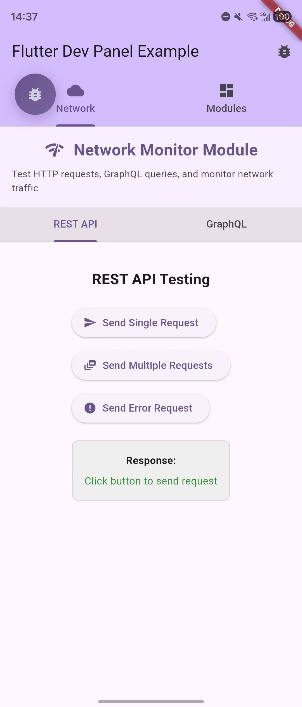
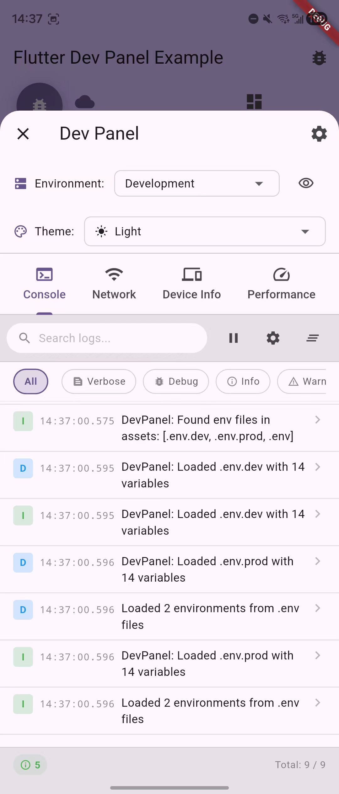
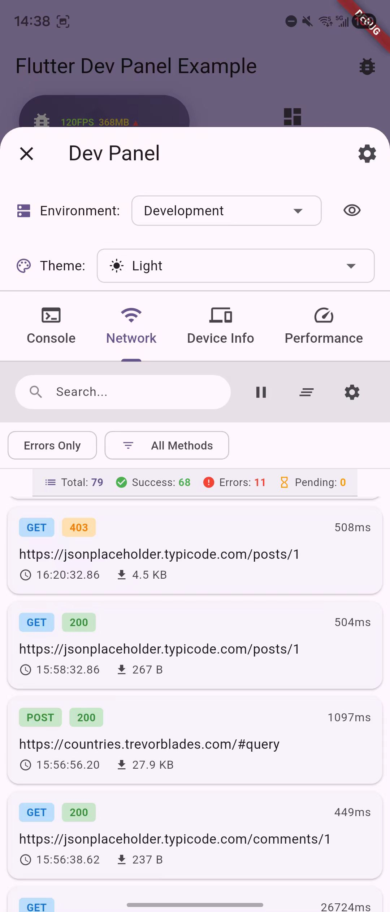
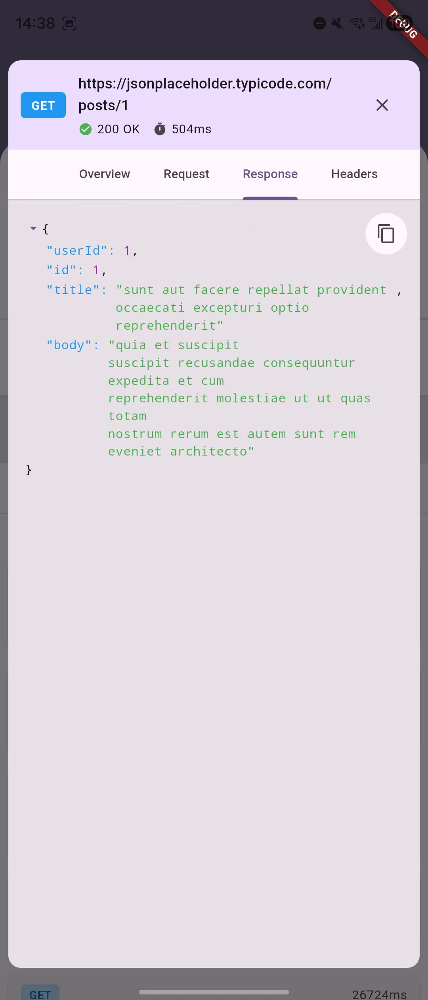
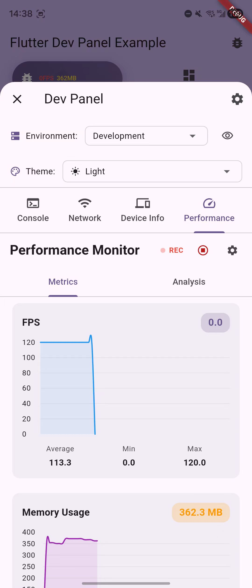

# Flutter Dev Panel

[](https://pub.dev/packages/flutter_dev_panel)
[](https://opensource.org/licenses/MIT)

一个模块化、零侵入的 Flutter 应用调试面板，提供实时监控和调试功能。

[English Documentation](README.md)



## 特性

### 核心能力
- **零侵入**：不影响生产代码
- **模块化架构**：按需加载所需模块
- **高性能**：优化以最小化对应用性能的影响
- **多种触发方式**：悬浮按钮、摇一摇手势或程序化调用

### 内置功能

#### 环境管理
- 环境切换（开发/生产/自定义）
- 环境变量管理
- 配置持久化
- 实时环境更新
- .env 文件支持
- 优先级配置加载（--dart-define > .env 文件 > 代码配置）

#### 主题管理
- 明亮/暗黑/跟随系统主题模式
- 与应用主题双向同步
- 主题持久化

## 可用模块

### Console 模块 (`flutter_dev_panel_console`)
- 实时日志捕获（print、debugPrint、Logger 包）
- 日志级别过滤（verbose、debug、info、warning、error）
- 搜索和过滤功能
- 可配置的日志保留和自动滚动
- 智能合并 Logger 包的多行输出



### Network 模块 (`flutter_dev_panel_network`)
- HTTP 请求/响应监控
- GraphQL 查询和变更跟踪
- 支持 Dio、http 和 GraphQL 包
- 请求历史持久化
- 详细的请求/响应检查
- 带语法高亮的 JSON 查看器




### Device 模块 (`flutter_dev_panel_device`)
- 设备型号和规格
- 屏幕尺寸和 PPI 计算
- 操作系统信息
- 平台特定详情
- 应用包信息


### Performance 模块 (`flutter_dev_panel_performance`)
- 实时 FPS 监控
- 内存使用跟踪
- 帧丢失检测
- 性能图表和趋势
- 内存峰值跟踪



## 架构

Flutter Dev Panel 使用**完全模块化架构**，确保：
- ✅ **生产环境零开销** - 未使用的代码被 tree shaking 完全移除
- ✅ **按需付费** - 只有导入的模块会包含在应用中
- ✅ **生产安全** - 编译时常量确保在发布版本中自动禁用

### 工作原理

1. **编译时优化**：所有调试代码都包装在 `if (kDebugMode || _forceDevPanel)` 检查中
2. **Tree shaking**：在发布版本中，Dart 编译器会移除所有不可达代码
3. **模块化导入**：每个模块是用户显式导入的独立包
4. **零运行时开销**：未启用时，性能影响为零

## 安装

### 选项 1：仅核心包（最小化）

```yaml
dependencies:
  flutter_dev_panel: ^1.0.0
```

### 选项 2：包含特定模块（推荐）

```yaml
dependencies:
  flutter_dev_panel: ^1.0.0
  flutter_dev_panel_console: ^1.0.0    # 日志功能
  flutter_dev_panel_network: ^1.0.0    # 网络监控
  # 仅添加需要的模块
```

### 选项 3：所有模块

```yaml
dependencies:
  flutter_dev_panel: ^1.0.0
  flutter_dev_panel_console: ^1.0.0
  flutter_dev_panel_network: ^1.0.0
  flutter_dev_panel_device: ^1.0.0
  flutter_dev_panel_performance: ^1.0.0
```

## 快速开始

> **重要**：根据需求选择正确的初始化方法：
> - **方法 1**：自动设置并完整捕获日志 ✅（推荐）
> - **方法 2**：自定义 Zone 设置以与其他工具集成 🔧
> - **方法 3**：传统初始化，无 print 拦截 ⚠️

### 方法 1：使用 DevPanel.init（推荐）

自动设置 Zone 来拦截 print 语句并正确处理所有初始化。**无需手动调用 `WidgetsFlutterBinding.ensureInitialized()`**。

```dart
import 'package:flutter_dev_panel/flutter_dev_panel.dart';
// 导入需要的模块
import 'package:flutter_dev_panel_console/flutter_dev_panel_console.dart';
import 'package:flutter_dev_panel_network/flutter_dev_panel_network.dart';

void main() async {
  await DevPanel.init(
    () => runApp(const MyApp()),
    modules: [
      const ConsoleModule(),
      NetworkModule(),
      const DeviceModule(),
      const PerformanceModule(),
    ],
  );
}

// 或使用自定义初始化
void main() async {
  await DevPanel.init(
    () async {
      // DevPanel.init 会自动调用 WidgetsFlutterBinding.ensureInitialized()
      // 你不需要手动调用它
      
      // 你的初始化代码
      await initServices();
      await setupDependencies();
      
      // 监听环境变化
      DevPanel.environment.addListener(() {
        final apiUrl = DevPanel.environment.getString('API_URL');
        // 使用新 URL 更新服务
      });
      
      runApp(const MyApp());
    },
    config: const DevPanelConfig(
      triggerModes: {TriggerMode.fab, TriggerMode.shake},
      loadFromEnvFiles: true,  // 自动加载 .env 文件（默认：true）
    ),
    modules: [
      const ConsoleModule(),
      NetworkModule(),
    ],
  );
}
```

### 方法 2：自定义 Zone 设置（与 Sentry/Crashlytics 集成）

用于与错误跟踪服务（如 Sentry 或 Firebase Crashlytics）集成。

```dart
void main() {
  runZonedGuarded(() async {
    WidgetsFlutterBinding.ensureInitialized();
    
    // 初始化服务
    await initServices();
    
    // 初始化 Dev Panel
    DevPanel.initialize(
      modules: [ConsoleModule(), NetworkModule()],
    );
    
    runApp(const MyApp());
  }, (error, stack) {
    // 发送到多个服务
    DevPanel.logError('Uncaught error', error: error, stackTrace: stack);
    Sentry.captureException(error, stackTrace: stack);
  }, zoneSpecification: ZoneSpecification(
    print: (Zone self, ZoneDelegate parent, Zone zone, String line) {
      DevPanel.log(line);  // 捕获到 Dev Panel
      parent.print(zone, line);    // 仍然打印到控制台
    },
  ));
}
```

### 方法 3：传统初始化（简单设置）

**注意**：此方法不会自动捕获 print 语句。Console 模块只会显示直接调用 `DevPanel.log()` 的日志。

```dart
import 'package:flutter_dev_panel/flutter_dev_panel.dart';
// 导入需要的模块
import 'package:flutter_dev_panel_console/flutter_dev_panel_console.dart';
import 'package:flutter_dev_panel_network/flutter_dev_panel_network.dart';

void main() async {
  WidgetsFlutterBinding.ensureInitialized();
  
  // 使用选定的模块初始化 dev panel
  DevPanel.initialize(
    modules: [
      const ConsoleModule(),
      NetworkModule(),
      // 根据需要添加更多模块
    ],
  );
  
  // 初始化环境（可选 - .env 文件会自动加载）
  // 仅在需要提供备用配置时使用
  await DevPanel.environment.initialize(
    environments: [
      const EnvironmentConfig(
        name: 'Development',
        variables: {
          'api_url': 'https://dev.api.example.com',
          'api_key': '',  // 将被 --dart-define=api_key=xxx 覆盖
          'debug': true,
          'timeout': 30000,
        },
        isDefault: true,
      ),
      const EnvironmentConfig(
        name: 'Production',
        variables: {
          'api_url': 'https://api.example.com',
          'api_key': '',  // 将被 --dart-define=api_key=xxx 覆盖
          'debug': false,
          'timeout': 10000,
        },
      ),
    ],
  );

  runApp(MyApp());
}

class MyApp extends StatelessWidget {
  @override
  Widget build(BuildContext context) {
    // 监听 dev panel 的主题变化
    return ValueListenableBuilder<ThemeMode>(
      valueListenable: ThemeManager.instance.themeMode,
      builder: (context, themeMode, child) {
        return MaterialApp(
          title: 'Flutter Demo',
          theme: ThemeData.light(),
          darkTheme: ThemeData.dark(),
          themeMode: themeMode,  // 应用 dev panel 的主题
          builder: (context, child) {
            return DevPanelWrapper(
              child: child ?? const SizedBox.shrink(),
            );
          },
          home: MyHomePage(),
        );
      },
    );
  }
}
```

## 使用

### 访问面板
- **悬浮按钮**：点击 FAB（默认）
- **摇一摇手势**：摇动设备（仅限移动设备）
- **程序化调用**：`DevPanel.open(context)`

### 日志记录

Flutter Dev Panel 提供统一的日志 API：

```dart
// 简单日志记录
DevPanel.log('User action');
DevPanel.logInfo('Request completed');
DevPanel.logWarning('Low memory');
DevPanel.logError('Failed to load', error: e, stackTrace: s);

// 自动 print 拦截（使用 DevPanel.init 时）
print('This will be captured automatically');
debugPrint('This too');

// Logger 包也会被自动捕获
final logger = Logger();
logger.i('Info from Logger package');
```

详细的日志功能，请参阅 [Console 模块文档](https://pub.dev/packages/flutter_dev_panel_console)。

### 集成方法

#### 使用 Builder 模式（推荐）
```dart
// 适用于 MaterialApp、GetMaterialApp 等
MaterialApp(
  builder: (context, child) {
    return DevPanelWrapper(
      child: child ?? const SizedBox.shrink(),
    );
  },
  home: MyHomePage(),
)
```

Builder 模式适用于：
- GetX (`GetMaterialApp`)
- Auto Route 导航
- 复杂导航设置的应用
- 全局覆盖需求

### 获取环境变量
```dart
// 使用便捷方法（推荐）
final apiUrl = DevPanel.environment.getString('api_url');
final isDebug = DevPanel.environment.getBool('debug');
final timeout = DevPanel.environment.getInt('timeout');

// 监听环境变化
ListenableBuilder(
  listenable: DevPanel.environment,
  builder: (context, _) {
    final apiUrl = DevPanel.environment.getString('api_url');
    // 环境切换时 UI 自动更新
    return Text('API: $apiUrl');
  },
);
```

### 动态端点切换

对于 **Dio**（简单 - 可直接修改）：
```dart
class ApiService {
  final dio = Dio();
  
  ApiService() {
    NetworkModule.attachToDio(dio); // 只需一次
    _updateConfig();
    DevPanel.environment.addListener(_updateConfig);
  }
  
  void _updateConfig() {
    // 直接修改选项
    dio.options.baseUrl = DevPanel.environment.getString('api_url') ?? '';
  }
}
```

对于 **GraphQL**（需要重新创建客户端）：
```dart
class GraphQLService extends ChangeNotifier {
  GraphQLClient? _client;
  GraphQLClient get client => _client ?? _createClient();
  
  void initialize() {
    _client = _createClient();
    DevPanel.environment.addListener(_onEnvironmentChanged);
  }
  
  void _onEnvironmentChanged() {
    _client = _createClient(); // 使用新端点重新创建
    notifyListeners();
  }
  
  GraphQLClient _createClient() {
    final endpoint = DevPanel.environment.getString('graphql_endpoint') 
        ?? 'https://api.example.com/graphql';
    
    final link = NetworkModule.createGraphQLLink(
      HttpLink(endpoint),
      endpoint: endpoint,
    );
    
    return GraphQLClient(link: link, cache: GraphQLCache());
  }
}
```

详情请参阅 [GraphQL 环境切换指南](docs/graphql_environment_switching.md)。

### 网络监控设置

对于 **Dio**（推荐）：
```dart
final dio = Dio();
NetworkModule.attachToDio(dio);  // 直接修改 dio
// 正常使用 dio
```

对于 **GraphQL**：

方法 1 - 创建时添加监控（推荐）：
```dart
// 创建客户端时添加监控
final link = NetworkModule.createGraphQLLink(
  HttpLink('https://api.example.com/graphql'),
  endpoint: 'https://api.example.com/graphql',
);

final graphQLClient = GraphQLClient(
  link: link,
  cache: GraphQLCache(),
);

// 直接使用 graphQLClient - 无需包装
```

方法 2 - 包装现有客户端：
```dart
// 如果已有客户端
GraphQLClient client = GraphQLClient(...);

// 注意：GraphQL 客户端是不可变的，所以必须重新赋值
client = NetworkModule.wrapGraphQLClient(client);

// 现在使用包装后的客户端
```

对于 **HTTP**（替代方案）：
```dart
// 使用拦截器模式
final client = NetworkInterceptor.http(http.Client());
```

## 环境管理

### 配置优先级
环境变量按以下优先级顺序加载（从高到低）：
1. **--dart-define** - 命令行参数（自动检测）
2. **.env 文件** - 环境特定文件（如果存在）
3. **代码配置** - `initialize()` 中的默认值
4. **保存的配置** - 之前运行时的值

**工作原理：**
- 系统自动从配置中发现所有键
- 通过 --dart-define 传递的任何匹配键将覆盖其他源
- 键匹配不区分大小写，支持格式变化（snake_case、dash-case）

### 推荐设置

1. **创建环境文件：**
```bash
# .env.example（提交到 git - 模板）
API_URL=https://api.example.com
API_KEY=your-key-here
ENABLE_ANALYTICS=false

# .env.development（提交到 git - 安全默认值）
API_URL=https://dev.api.example.com
ENABLE_ANALYTICS=false

# .env.production（提交到 git - 非敏感配置）
API_URL=https://api.example.com
ENABLE_ANALYTICS=true
# 敏感值通过 CI/CD 中的 --dart-define 注入
```

2. **添加到 pubspec.yaml（用于生产构建）：**
```yaml
flutter:
  assets:
    - .env.production  # 发布构建需要
```

3. **添加到 .gitignore（仅本地覆盖）：**
```gitignore
.env
.env.local
.env.*.local
!.env.example
!.env.development
!.env.production
```

4. **构建命令：**
```bash
# 开发（使用 .env.development）
flutter run

# 生产构建，从 CI/CD 获取密钥
flutter build apk \
  --dart-define=API_KEY=$SECRET_API_KEY \
  --dart-define=DB_PASSWORD=$SECRET_DB_PASSWORD

# CI/CD 示例
flutter build ios \
  --dart-define=API_KEY=${{ secrets.API_KEY }} \
  --dart-define=SENTRY_DSN=${{ secrets.SENTRY_DSN }}
```

### 配置策略

**提交到 Git：**
- `.env.development` - 开发 URL 和非敏感配置
- `.env.production` - 生产 URL 和非敏感配置
- `.env.example` - 包含所有变量文档的模板

**通过 CI/CD 注入（--dart-define）：**
- API 密钥、令牌、密码
- 第三方服务凭据
- 任何敏感配置
- 环境特定覆盖

**优势：**
- 非敏感配置受版本控制
- 敏感数据永不接触代码库
- CI/CD 可以覆盖配置中定义的任何值
- 开发者无需手动设置即可运行应用
- 无需维护硬编码的键列表

### --dart-define 的工作原理

1. **在环境配置中定义键**并提供默认值：
```dart
const EnvironmentConfig(
  name: 'Production',
  variables: {
    'api_url': 'https://api.example.com',
    'api_key': '',  // 空默认值，将被注入
    'sentry_dsn': '',  // 空默认值，将被注入
  },
)
```

2. **通过 --dart-define 在 CI/CD 中覆盖**：
```bash
flutter build apk \
  --dart-define=api_key=${{ secrets.API_KEY }} \
  --dart-define=sentry_dsn=${{ secrets.SENTRY_DSN }}
```

系统会自动检测并应用这些覆盖。

## 配置

```dart
DevPanel.initialize(
  config: const DevPanelConfig(
    triggerModes: {
      TriggerMode.fab,
      TriggerMode.shake,
    },
    enableLogCapture: true,  // 捕获 print 语句（默认：true）
  ),
  modules: [...],
);
```

## 主题集成

如果应用已有主题管理，可以与 dev panel 同步，以下是示例代码：

```dart
class MyApp extends StatefulWidget {
  @override
  _MyAppState createState() => _MyAppState();
}

class _MyAppState extends State<MyApp> {
  late ThemeMode _themeMode;
  
  @override
  void initState() {
    super.initState();
    // 加载应用保存的主题偏好
    _themeMode = MyThemePreferences.getThemeMode();
    
    // 将 dev panel 与应用主题同步
    ThemeManager.instance.setThemeMode(_themeMode);
    
    // 监听 dev panel 主题变化
    ThemeManager.instance.themeMode.addListener(_onThemeChanged);
  }
  
  void _onThemeChanged() {
    setState(() {
      _themeMode = ThemeManager.instance.themeMode.value;
      // 保存到应用偏好
      MyThemePreferences.saveThemeMode(_themeMode);
    });
  }
  
  @override
  void dispose() {
    ThemeManager.instance.themeMode.removeListener(_onThemeChanged);
    super.dispose();
  }
  
  @override
  Widget build(BuildContext context) {
    return MaterialApp(
      theme: ThemeData.light(),
      darkTheme: ThemeData.dark(),
      themeMode: _themeMode,
      home: MyHomePage(),
    );
  }
}
```

这种方法：
- 在启动时加载现有的主题偏好
- 将 dev panel 与应用当前主题同步
- 通过 dev panel 更改时更新应用偏好
- 保持应用和 dev panel 主题之间的一致性

## 模块配置

### Console 模块
```dart
// 通过模块初始化配置
ConsoleModule(
  logConfig: const LogCaptureConfig(
    maxLogs: 1000,              // 保留的最大日志数（默认：1000）
    autoScroll: true,           // 自动滚动到最新日志（默认：true）
    combineLoggerOutput: true,  // 合并 Logger 包多行输出（默认：true）
  ),
)

// 默认配置通常足够
ConsoleModule()  // 使用默认值：maxLogs=1000, autoScroll=true, combineLoggerOutput=true
```

### Performance 模块
性能模块自动监控：
- 帧率（FPS）
- 内存使用和峰值
- 帧丢失检测
- 实时性能图表

### Device 模块
设备模块显示：
- 设备信息（型号、操作系统、版本）
- 屏幕详情（尺寸、分辨率、PPI）
- 应用信息（包名、版本、构建号）

## 生产安全

面板为生产构建提供多层保护：

### 1. 默认行为
- **调试模式**：自动启用
- **发布模式**：自动禁用（代码被 tree shaking 优化）

### 2. 在生产环境强制启用
对于内部测试版本，可以在发布模式下启用面板：

```bash
# 构建时启用开发面板
flutter build apk --release --dart-define=FORCE_DEV_PANEL=true

# CI/CD 示例
flutter build ios --release \
  --dart-define=FORCE_DEV_PANEL=true \
  --dart-define=API_KEY=${{ secrets.API_KEY }}
```

### 3. API 保护
所有公共 API 使用编译时常量检查：
- API 在发布模式下变成空操作（除非 `FORCE_DEV_PANEL=true`）
- Tree-shaking 自动移除未使用代码
- 生产环境零运行时开销

### 4. 生产环境零开销
当未强制启用时：
- 不渲染 UI 组件
- 不捕获日志
- 不进行性能监控
- 代码被 tree-shaking 完全移除
- 不影响应用大小和性能

## 高级用法

### 创建自定义模块

通过扩展 `DevModule` 创建自己的自定义模块：

```dart
class CustomModule extends DevModule {
  @override
  String get name => 'Custom';
  
  @override
  IconData get icon => Icons.extension;
  
  @override
  Widget buildPage(BuildContext context) {
    return YourCustomPage();
  }
  
  @override
  Widget? buildFabContent(BuildContext context) {
    // 可选：返回一个小部件在 FAB 中显示
    return Text('Custom Info');
  }
}
```

### 生产安全

Dev Panel 为生产构建提供多层保护：

#### 1. 默认行为
- **调试模式**：自动启用
- **发布模式**：自动禁用（代码被 tree shaking 移除）

#### 2. 在生产环境强制启用
对于内部测试版本，可以在发布模式下启用面板：

```bash
# 在发布模式下启用 dev panel
flutter build apk --release --dart-define=FORCE_DEV_PANEL=true

# CI/CD 示例
flutter build ios --release \
  --dart-define=FORCE_DEV_PANEL=true \
  --dart-define=API_KEY=${{ secrets.API_KEY }}
```

#### 3. API 保护
所有公共 API 检查编译时常量：
- API 在发布模式下变成空操作（除非 `FORCE_DEV_PANEL=true`）
- Tree-shaking 自动移除未使用代码
- 生产环境零运行时开销

#### 4. 生产环境零开销
当未在发布版本中强制启用时：
- 不渲染 UI 组件
- 不捕获日志
- 不进行性能监控
- 代码被 tree-shaking 完全移除
- 不影响应用大小或性能

每个模块包都依赖于核心 `flutter_dev_panel` 包，可以独立安装。

## 测试

```bash
# 运行所有测试
flutter test

# 测试各个模块
flutter test packages/flutter_dev_panel_console/test
flutter test packages/flutter_dev_panel_network/test
flutter test packages/flutter_dev_panel_device/test
flutter test packages/flutter_dev_panel_performance/test

# 运行示例应用
cd example
flutter run
```

## 许可证

MIT 许可证 - 详情请参阅 [LICENSE](LICENSE) 文件